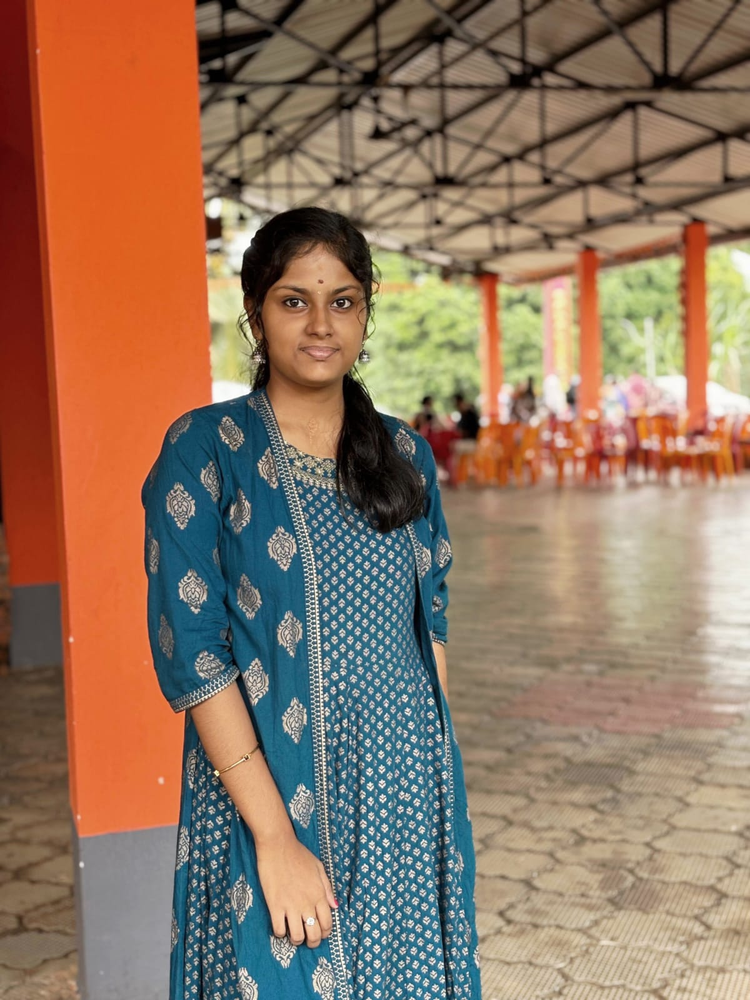

<!DOCTYPE html>
<html lang="en">

<head>
    <meta charset="UTF-8">
    <meta name="viewport" content="width=device-width, initial-scale=1.0">
    <title>Divya B MTP Portfolio</title>
    <link rel="preconnect" href="https://fonts.googleapis.com" />
    <link rel="preconnect" href="https://fonts.gstatic.com" crossorigin />
    <link href="https://fonts.googleapis.com/css2?family=Plus+Jakarta+Sans:wght@400;500;700;800&display=swap" rel="stylesheet" />
    <link rel="stylesheet" href="https://cdnjs.cloudflare.com/ajax/libs/font-awesome/6.4.0/css/all.min.css" />
    
</head>
<body>
    <!-- Navigation -->
    <nav id="navbar">
        

            
FB

            <ul class="nav-links">
                <li><a href="#about">About</a></li>
                <li><a href="#skills">Skills</a></li>
                <li><a href="#contact">Contact</a></li>
            </ul>
        

    </nav>
    <!-- Google Font -->
    <link href="https://fonts.googleapis.com/css2?family=Poppins:wght@300;400;600&display=swap" rel="stylesheet">

    
</head>

<body>

    

        

            
            <h1>Divya B</h1>
            
B.Tech CSE (AI & Data Science) Student

        

        <section class="about">
            <h2>About Me</h2>
            

                I'm Divya B, a first-year B.Tech student in Computer Science and Engineering
                (AI & Data Science) at Lal Bahadhur Shastri College of Engineering, Kasaragod.
                I am passionate about coding, problem solving, and learning new technologies. I like working on projects that challenge me and help me grow as a developer. I am eager to explore the world of AI and data science and contribute to innovative solutions in the future. 
            

        </section>
        
        <h2>Education</h2>
        <ul>

            <li>B.Tech in CSE(ai and data science)-2025-2029</li>
            <li>Higher Secodary Education-Science Stream</li>
        </ul>
        <h2>Technical Skills</h2>

        
C Programming

        

            

        

        
Python

        

            

        

        
Problem Solving

        

            

        

        <section>
            <h2>Skills</h2>
            

                
C Programming (Basics)

                
Python (Basics)

                
Problem Solving

                
HTML

                
CSS

            

        </section>

        <h2>contact</h2>
        <section id="contact">
            <h2>9495784492</h2>
            
Email:divyaabhatb@gmail.com

        

        

            <a href="https://github.com/divyabhatb" target="_blank" class="btn">
                Visit My GitHub
            </a>
        

    

    
    <section class="section reveal" id="skills">
            <h2>Skills</h2>
            

                

                    <h3>Technical</h3>
                    <ul>
                        <li>Python (Basics to Intermediate)</li>
                        <li>Web Development (HTML, CSS, JavaScript)</li>
                    </ul>
                

                

                    <h3>Leadership & Communication</h3>
                    <ul>
                        <li>Leadership & Communication</li>
                        <li>Community Building</li>
                        <li>Event & Webinar Coordination</li>
                        <li>Public Speaking & Presentation</li>
                    </ul>
                

            

        </section>

        <section class="section reveal" id="contact">
            <h2>Let's Connect</h2>
            
I'm always interested in hearing about new projects and opportunities. Feel free to reach out!

            

                <a href="https://github.com/divyabhatb" target="_blank" rel="noopener noreferrer" class="btn btn-primary">
                    <i class="fab fa-github"></i> View My GitHub
                </a>
                <a href="mailto:divyaabhatb@gmail.com" class="btn btn-secondary">
                    <i class="fas fa-envelope"></i> Send Email
                </a>
            

        </section>
    

    

</body>

</html